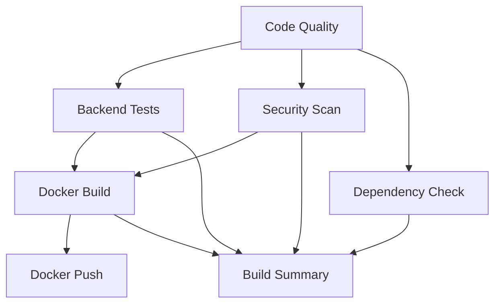

# GitHub Actions CI/CD Pipeline

Diese CI/CD Pipeline wird automatisch bei jedem Push oder Pull Request auf die `main`/`master` Branches ausgeführt.

## 🔄 Workflow Jobs

### 1. **Code Quality & Linting**
- **Black**: Code Formatting Check
- **Flake8**: Python Linting
- **Syntax Check**: Python-Syntaxvalidierung

### 2. **Backend Tests**
- Python 3.11 Environment
- Dependency Installation
- Unit Tests (wenn vorhanden)
- Code Coverage Report

### 3. **Docker Build & Test**
- Multi-stage Docker Build
- Container Health Check
- Log Validation
- Layer Caching für schnellere Builds

### 4. **Docker Hub Push** (nur main branch)
- Automatischer Push zu Docker Hub
- Tags: `latest` und `main-<sha>`
- Benötigt Secrets: `DOCKER_USERNAME`, `DOCKER_PASSWORD`

### 5. **Security Scan**
- Trivy Vulnerability Scanner
- SARIF Report Upload zu GitHub Security
- Filesystem und Dependency Scanning

### 6. **Dependency Check**
- Safety Check für Python Dependencies
- Identifiziert bekannte Sicherheitslücken

### 7. **Build Summary**
- Zusammenfassung aller Job-Resultate
- Übersichtliche Status-Anzeige

---

## 🔐 Required Secrets

Für die Docker Hub Integration müssen folgende Secrets in den Repository Settings konfiguriert werden:

```
DOCKER_USERNAME - Dein Docker Hub Username
DOCKER_PASSWORD - Dein Docker Hub Password/Token
```

**Secrets hinzufügen:**
1. Gehe zu Repository Settings → Secrets and variables → Actions
2. Klicke auf "New repository secret"
3. Füge `DOCKER_USERNAME` und `DOCKER_PASSWORD` hinzu

---

## 📊 Status Badge

Füge diesen Badge zu deinem README hinzu:

```markdown
[](https://github.com/IT-Networks/Dmx-Web-Controller/actions/workflows/ci-cd.yml)
```

---

## 🛠️ Lokales Testen

Du kannst die Pipeline-Schritte auch lokal ausführen:

### Code Quality
```bash
# Install tools
pip install black flake8

# Run Black
black --check backend/

# Run Flake8
flake8 backend/ --count --select=E9,F63,F7,F82 --show-source --statistics
```

### Docker Build
```bash
# Build image
docker build -t dmx-web-controller:test .

# Run container
docker run -d --name dmx-test -p 8000:8000 dmx-web-controller:test

# Check logs
docker logs dmx-test

# Test endpoint
curl http://localhost:8000/docs

# Cleanup
docker stop dmx-test && docker rm dmx-test
```

### Security Scan
```bash
# Install Trivy
# macOS: brew install aquasecurity/trivy/trivy
# Linux: https://aquasecurity.github.io/trivy/latest/getting-started/installation/

# Run scan
trivy fs --security-checks vuln,config .
```

---

## 🚀 Workflow Triggers

Die Pipeline läuft automatisch bei:
- ✅ Push auf `main` oder `master` Branch
- ✅ Pull Requests zu `main` oder `master` Branch

**Manuell triggern:**
1. Gehe zu Actions Tab
2. Wähle "CI/CD Pipeline"
3. Klicke "Run workflow"

---

## 📝 Job Dependencies



---

## ⚙️ Customization

### Disable Docker Hub Push
Wenn du nicht zu Docker Hub pushen möchtest, kommentiere den `docker-push` Job aus oder setze die Condition auf `false`:

```yaml
docker-push:
  if: false  # Disabled
```

### Add More Tests
Erstelle `backend/tests/` Verzeichnis und füge Pytest-Tests hinzu:

```python
# backend/tests/test_main.py
def test_example():
    assert 1 + 1 == 2
```

### Adjust Python Version
Ändere die Python-Version in allen Jobs:

```yaml
- name: Set up Python
  uses: actions/setup-python@v5
  with:
    python-version: '3.12'  # Deine gewünschte Version
```

---

## 🐛 Troubleshooting

### Job fails: "Docker login failed"
- Überprüfe, ob `DOCKER_USERNAME` und `DOCKER_PASSWORD` Secrets gesetzt sind
- Verwende einen Docker Hub Access Token statt Passwort

### Job fails: "Module not found"
- Stelle sicher, dass `requirements.txt` alle Dependencies enthält
- Cache löschen: GitHub Actions → Caches → Delete

### Job takes too long
- Docker Layer Caching ist aktiviert → sollte nach erstem Build schneller sein
- Pip Caching ist aktiviert

---

## 📚 Weitere Ressourcen

- [GitHub Actions Documentation](https://docs.github.com/en/actions)
- [Docker Build Push Action](https://github.com/docker/build-push-action)
- [Trivy Scanner](https://github.com/aquasecurity/trivy)
- [Safety Check](https://pypi.org/project/safety/)
